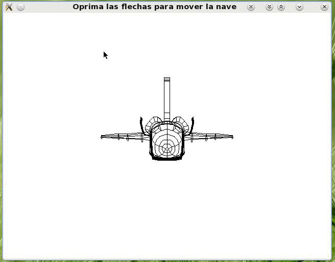

# Códigos y diapositivas de Lenguaje C

Fuente: no fuí capaz de encontrarla... esta caricatura es de FOXTROT (http://www.foxtrot.com/). Finalmente observe que falta un `\n` al final del `printf();` aun mejor, debió haber utilizado un `puts()` en vez del `printf()`, simplemente para hacer el código más veloz.

## 01 - Introducción al lenguaje C
[Diapositivas](../../diapositivas/C/01_-_Introduccion_a_C.pdf)
- [01_hello.asm](../../codigo/otros/01_hello.asm)
- [01_hello.c](../../codigo/C/01_hello.c)
- [01_miprimerprograma.c](../../codigo/C/01_miprimerprograma.c)
- [01_mpp.zip](../../codigo/C/01_mpp.zip) (versión que usa `#include" "`)

## 02 - Conceptos fundamentales sobre el tratamiento de datos
[Diapositivas](../../diapositivas/C/02_-_Tipos_de_datos.pdf)
- [02_char.c](../../codigo/C/02_char.c)
- [02_int.c](../../codigo/C/02_int.c)
- [02_ejemplo_bool.c](../../codigo/C/02_ejemplo_bool.c)
- [02_complemento_a_2.c](../../codigo/C/02_complemento_a_2.c)
- [02_evite_usar_float.c](../../codigo/C/02_evite_usar_float.c)
- [02_DBL_EPSILON.c](../../codigo/C/02_DBL_EPSILON.c)
- [02_complex.c](../../codigo/C/02_complex.c)
- [02_pointer.c](../../codigo/C/02_pointer.c)
- [02_imprimir_ASCII.c](../../codigo/C/02_imprimir_ASCII.c)
- [02_big_little_endian.c](../../codigo/C/02_big_little_endian.c)
- [02_limites_para_enteros.c](../../codigo/C/02_limites_para_enteros.c)
- [02_limites_para_reales.c](../../codigo/C/02_limites_para_reales.c)
- [02_wrap.c](../../codigo/C/02_wrap.c)
- [02_compara_reales.c](../../codigo/C/02_compara_reales.c)
- [02_increm.c](../../codigo/C/02_increm.c)
- [02_operador_or.c](../../codigo/C/02_operador_or.c)
- [02_division.c](../../codigo/C/02_division.c)
- [02_casting.c](../../codigo/C/02_casting.c)

# 03 - Entrada y salida en lenguaje C
[Diapositivas](../../diapositivas/C/03_-_Entrada_y_salida_en_lenguaje_C.pdf)
- [03_putchar.c](../../codigo/C/03_putchar.c)
- [03_puts.c](../../codigo/C/03_puts.c)
- [03_printf.c](../../codigo/C/03_printf.c)
- [03_ejemplo_contador.c](../../codigo/C/03_ejemplo_contador.c)
- [03_locale.c](../../codigo/C/03_locale.c)
- [03_scanf.c](../../codigo/C/03_scanf.c)
- [03_unicode.c](../../codigo/C/03_unicode.c)
- [03_getchar.c](../../codigo/C/03_getchar.c)
- [03_gets.c](../../codigo/C/03_gets.c)
- [03_gets_s.c](../../codigo/C/03_gets_s.c)
- [03_fgets.c](../../codigo/C/03_fgets.c)
- [03_problem_scanf.c](../../codigo/C/03_problem_scanf.c)
- [03_sol_problem_scanf.c](../../codigo/C/03_sol_problem_scanf.c)

**Programas con curses.h/ncurses.h:**
- [03_hello_world_ncurses.c](../../codigo/C/03_hello_world_ncurses.c)
- [03_init_func_example.c](../../codigo/C/03_init_func_example.c)
- [03_scanw_example.c](../../codigo/C/03_scanw_example.c)
- [03_colores_curses.c](../../codigo/C/03_colores_curses.c)
- [03_chars_curses.c](../../codigo/C/03_chars_curses.c)
- [03_keys_curses.c](../../codigo/C/03_keys_curses.c)
- [03_mouse_curses.c](../../codigo/C/03_mouse_curses.c)

## 04 - Sentencias de control condicionales y ciclos
[Diapositivas](../../diapositivas/C/04_-_Sentencias_de_control_condicionales_y_ciclos.pdf)
- [04_if_else.c](../../codigo/C/04_if_else.c)
- [04_switch_case_default.c](../../codigo/C/04_switch_case_default.c)
- [04_while.c](../../codigo/C/04_while.c)
- [04_do_while.c](../../codigo/C/04_do_while.c)
- [04_for.c](../../codigo/C/04_for.c)
- [04_imprimir_binario.c](../../codigo/C/04_imprimir_binario.c)
- [04_break.c](../../codigo/C/04_break.c)
- [04_continue.c](../../codigo/C/04_continue.c)
- [04_goto.c](../../codigo/C/04_goto.c)

## 05 - Funciones
[Diapositivas](../../diapositivas/C/05_-_Funciones.pdf)
- [05_declaracion_funciones.c](../../codigo/C/05_declaracion_funciones.c)
- [05_global_vs_local.c](../../codigo/C/05_global_vs_local.c)
- [05_ambito.c](../../codigo/C/05_ambito.c)
- [05_static.c](../../codigo/C/05_static.c)
- [05_call_stack.c](../../codigo/C/05_call_stack.c)
- [05_par_ref_valor.c](../../codigo/C/05_par_ref_valor.c)
- [05_retorna_2_par.c](../../codigo/C/05_retorna_2_par.c)
- [05_circulo.c](../../codigo/C/05_circulo.c)
- [05_inline.c](../../codigo/C/05_inline.c)
- [05_recursion.c](../../codigo/C/05_recursion.c)
- [05_nested_functions.c](../../codigo/C/05_nested_functions.c)
- [05_salida_main.c](../../codigo/C/05_salida_main.c)
- [05_noreturn.c](../../codigo/C/05_noreturn.c)
- [05_main_con_par.c](../../codigo/C/05_main_con_par.c)
- [05_args.c](../../codigo/C/05_args.c)
- [05_stdarg.c](../../codigo/C/05_stdarg.c)
- [05_agotando_memoria_pila.c](../../codigo/C/05_agotando_memoria_pila.c)
- [05_puntero_a_fun1.c](../../codigo/C/05_puntero_a_fun1.c)
- [05_puntero_a_fun2.c](../../codigo/C/05_puntero_a_fun2.c)

Escriba un programa el cual contiene una función que evalúa el coseno de su argumento. Utilice la siguiente serie de funciones para aproximar la respuesta:
[[math]]
 \cos \theta = \sum^{\infty}_{m=0} \frac{(-1)^m}{(2m)!} \theta^{2m} = 1 - \frac{\theta^2}{2!} + \frac{\theta^4}{4!} - \cdots\quad\text{ para todo  } \theta
[[math]]
La función debe diferir a lo más en 1e-10 del valor verdadero. Cree una función recursiva llamada `factorial(n)` la cual retorna n! y otra función llamada `potencia(x,n)` la cual retorna el valor de x^n; utilice ambas funciones en el programa anterior.
- [05_calculo_cos.c](../../codigo/C/05_calculo_cos.c)

# 06 - Arrays y matrices
[Diapositivas](../../diapositivas/C/06_-_Arrays_y_matrices.pdf)
- [06_inicializacion.c](../../codigo/C/06_inicializacion.c)
- [06_array_bound_checking.c](../../codigo/C/06_array_bound_checking.c)
- [06_compound_literal.c](../../codigo/C/06_compound_literal.c)
- [06_ejemplo_compound_literal_arrays.c](../../codigo/C/06_ejemplo_compound_literal_arrays.c)
- [06_array3d.c](../../codigo/C/06_array3d.c)
- [06_filas_matriz.c](../../codigo/C/06_filas_matriz.c)
- [06_compound_literal_matrix.c](../../codigo/C/06_compound_literal_matrix.c)
- [06_loop_interchange.c](../../codigo/C/06_loop_interchange.c)
- [06_cadena.c](../../codigo/C/06_cadena.c)
- [06_array_cadenas.c](../../codigo/C/06_array_cadenas.c)
- [06_array_cadenas2.c](../../codigo/C/06_array_cadenas2.c)
- [06_memcpy_vs_for.c](../../codigo/C/06_memcpy_vs_for.c)
- [06_alg_ordenamiento.c](../../codigo/C/06_alg_ordenamiento.c)
- [06_alg_busqueda.c](../../codigo/C/06_alg_busqueda.c)
- [06_vector_malloc.c](../../codigo/C/06_vector_malloc.c)
- [06_matrix_malloc.c](../../codigo/C/06_matrix_malloc.c)
- [06_big_matrix_crash.c](../../codigo/C/06_big_matrix_crash.c)
- [06_big_matrix_crash_sol1.c](../../codigo/C/06_big_matrix_crash_sol1.c)
- [06_big_matrix_crash_sol2.c](../../codigo/C/06_big_matrix_crash_sol2.c)
- [06_matrices_par_func.c](../../codigo/C/06_matrices_par_func.c)
- [06_casting_array_a_matriz.c](../../codigo/C/06_casting_array_a_matriz.c)

* [Ted Jensen (2003) - A tutorial on pointers and arrays in C](http://home.earthlink.net/~momotuk/pointers.pdf)

Sin invocar a la librería `string.h`, escriba un programa que contiene una función que reciba como argumento dos cadenas y retorne lo siguiente: si ambas cadenas son iguales, retorne 0; si la primera cadena va antes que la segunda cadena al ordenarlas alfabéticamente, retorne un número negativo. Si la primera cadena va después que la segunda cadena al ordenarlas alfabéticamente, retorne un número positivo.
- [06_compara_cadenas.c](../../codigo/C/06_compara_cadenas.c)

Sin invocar a la librería `string.h`, escriba un programa que contiene una función que reciba como argumento dos cadenas y retorne lo siguiente: si la primera cadena es una subcadena de la segunda, retorne un puntero a la primera ocurrencia de esta en el segundo argumento, de lo contrario retorne el puntero `NULL`.
- [06_subcadena.c](../../codigo/C/06_subcadena.c)

# 07 - Tipos de datos definidos por el programador
[Diapositivas](../../diapositivas/C/07_-_Tipos_de_datos_definidos_por_el_programador.pdf)
- [07_enum.c](../../codigo/C/07_enum.c)
- [07_enum_warning.c](../../codigo/C/07_enum_warning.c)
- [07_for_enum.c](../../codigo/C/07_for_enum.c)
- [07_struct.c](../../codigo/C/07_struct.c)
- [07_igual_igual_struct.c](../../codigo/C/07_igual_igual_struct.c)
- [07_compound_literals.c](../../codigo/C/07_compound_literals.c)
- [07_funciones_retornando_arrays.c](../../codigo/C/07_funciones_retornando_arrays.c)
- [07_ej_uniones.c](../../codigo/C/07_ej_uniones.c)
- [07_struct_padding.c](../../codigo/C/07_struct_padding.c)
- [07_struct_padding2.c](../../codigo/C/07_struct_padding2.c)

# 08 - Punteros
[Diapositivas](../../diapositivas/C/08_-_Punteros.pdf)
- [02_pointer.c](../../codigo/C/02_pointer.c)
- [08_aritmetica_punteros2.c](../../codigo/C/08_aritmetica_punteros2.c)
- [08_aritmetica_punteros1.c](../../codigo/C/08_aritmetica_punteros1.c)
- [08_truco_arrays_cadenas.c](../../codigo/C/08_truco_arrays_cadenas.c)
- [08_puntero_a_constante.c](../../codigo/C/08_puntero_a_constante.c)
- [08_puntero_a_constante2.c](../../codigo/C/08_puntero_a_constante2.c)
- [08_puntero_constante.c](../../codigo/C/08_puntero_constante.c)
- [08_puntero_constante_a_constante.c](../../codigo/C/08_puntero_constante_a_constante.c)
- [08_puntero_void.c](../../codigo/C/08_puntero_void.c)
- [08_puntero_void_aritmetica.c](../../codigo/C/08_puntero_void_aritmetica.c)
- [08_comparacion_punteros.c](../../codigo/C/08_comparacion_punteros.c)
- [08_array_punteros.c](../../codigo/C/08_array_punteros.c)
- [08_array_punteros_vs_puntero_a_array.c](../../codigo/C/08_array_punteros_vs_puntero_a_array.c)
- [08_puntero_a_matriz.c](../../codigo/C/08_puntero_a_matriz.c)
- [08_punteros_a_funciones.c](../../codigo/C/08_punteros_a_funciones.c)
- [08_puntero_a_puntero.c](../../codigo/C/08_puntero_a_puntero.c)
- [08_puntero_a_puntero2.c](../../codigo/C/08_puntero_a_puntero2.c)
- [06_big_matrix_crash_sol2.c](../../codigo/C/06_big_matrix_crash_sol2.c)
- [08_typedef_con_punteros.c](../../codigo/C/08_typedef_con_punteros.c)
- [08_realloc.c](../../codigo/C/08_realloc.c)
- [08_memcpy.c](../../codigo/C/08_memcpy.c)
- [08_memmove.c](../../codigo/C/08_memmove.c)
- [08_memmove2.c](../../codigo/C/08_memmove2.c)
- [08_memset.c](../../codigo/C/08_memset.c)

Ejemplos con `restrict`:
- [08_mi_memcpy.c](../../codigo/C/08_mi_memcpy.c)
- [08_restrict.c](../../codigo/C/08_restrict.c)
- [08_restrict2.c](../../codigo/C/08_restrict2.c)

- [08_lista_simplemente_enlazada.c](../../codigo/C/08_lista_simplemente_enlazada.c) (NOTA: este código se puede mejorar)

# 09 - Archivos
[Diapositivas](../../diapositivas/C/09_-_Archivos.pdf)
- [09_crear_archivo.c](../../codigo/C/09_crear_archivo.c)
- [09_fclose.c](../../codigo/C/09_fclose.c)
- [09_feof_ferror.c](../../codigo/C/09_feof_ferror.c)
- [09_fgetc.c](../../codigo/C/09_fgetc.c)
- [09_fgets_fputs.c](../../codigo/C/09_fgets_fputs.c)
- [09_fprintf_fscanf.c](../../codigo/C/09_fprintf_fscanf.c)
- [09_fread.c](../../codigo/C/09_fread.c)
- [09_fseek.c](../../codigo/C/09_fseek.c)
- [09_ftell.c](../../codigo/C/09_ftell.c)
- [09_fwrite.c](../../codigo/C/09_fwrite.c)
- [09_imprimir_archivo.c](../../codigo/C/09_imprimir_archivo.c)
- [09_leer_archivo.c](../../codigo/C/09_leer_archivo.c)
- [09_perror.c](../../codigo/C/09_perror.c)
- [09_reverse.c](../../codigo/C/09_reverse.c)
- [09_rewind.c](../../codigo/C/09_rewind.c)
- [09_stdin_stdout_stderr.c](../../codigo/C/09_stdin_stdout_stderr.c)
- [09_tmpfile.c](../../codigo/C/09_tmpfile.c)
- [09_ungetc.c](../../codigo/C/09_ungetc.c)

---
---

# Códigos varios de programación
* Juego para adivinar un número entre 0 y 100: 
  - [04_juego_num_grande_pequeno.c](../../codigo/C/04_juego_num_grande_pequeno.c)

* Mastermind (tambien conocido como "picas y palas")
  - [04_mastermind.c](../../codigo/C/04_mastermind.c)

* Detector de minas
  - [05_detector_de_minas.c](../../codigo/C/05_detector_de_minas.c)

* Programa para resolver laberintos (como lo debería hacer alguien que está dentro de uno)
  - [05_laberinto.c](../../codigo/C/05_laberinto.c)

* Programa para resolver sudokus
  - [05_resolver_sudoku.c](../../codigo/C/05_resolver_sudoku.c)

* Programa para resolver laberintos (encontrando la ruta más corta)
  - [07_laberinto_ruta_corta.c](../../codigo/C/07_laberinto_ruta_corta.c)

* Buscaminas
  - [buscaminas_curses.c](../../codigo/C/juegos/buscaminas_curses.c) (requiere de: la librería pdcurses - [mingw_pdcurses.zip](../../codigo/C/mingw_pdcurses.zip))

* Pong

* Snake
  - [snake.c](../../codigo/C/juegos/snake.c) (requiere de: la librería pdcurses - [mingw_pdcurses.zip](../../codigo/C/mingw_pdcurses.zip))

* Pacman
  - [pacman.c](../../codigo/C/juegos/pacman/pacman.c) (requiere de: la librería pdcurses - [mingw_pdcurses.zip](../../codigo/C/mingw_pdcurses.zip))
[[image:pacman.png]]

* Sokoban + FBS

* [rotar3d (SDL)](../../codigo/C/juegos/rotar3d/rotar3d.zip)

